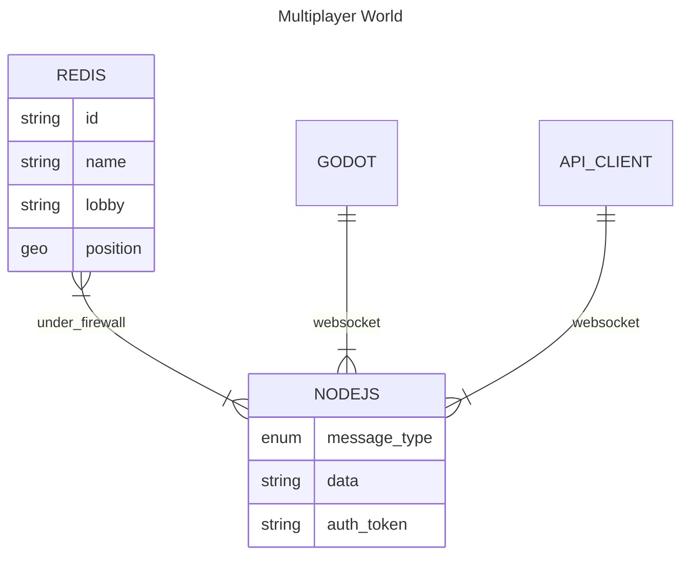

# Multiplayer world

## Motivation

I always find myself making multiple **minigames**. So I wanted to build a sort of an environment where people can:
- move
- chat
- talk
- play

I also wanted to have some common things for the games:
- common menu
- matchmaking
- avatars

I propose for this the following architecture:



## Requirements

- [Redis Stack](https://redis.io/download/)
- [Bun](https://bun.sh)

## Development
Create an .env file.

To start the development server run:
```bash
bun start
```

To connect from terminal a websocket, run:

```
bunx wscat -c ws://localhost:3000
```

## Commands

