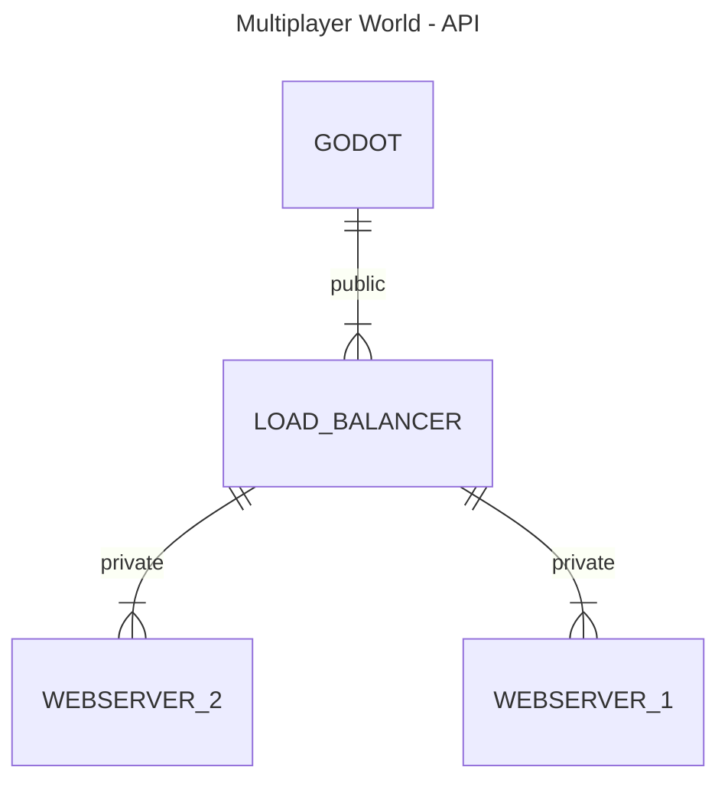
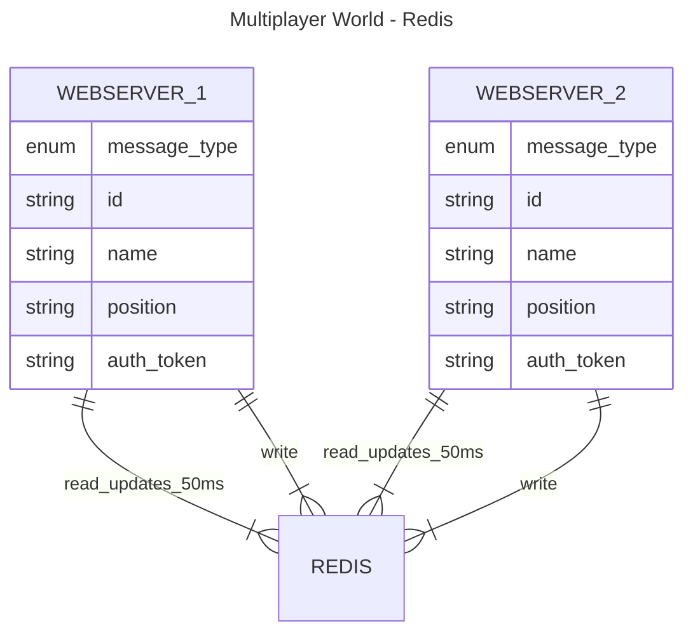

# Multiplayer world

## Motivation

I always find myself making multiple **minigames**. So I wanted to build a sort of an environment where people can:

- move
- text chat
- voice chat
- talk
- play

I also wanted to have some common things for the games:
- leaderboards
- friends
- relay
- lobby
- matchmaking
- multiplayer hosting
- multiplayer peer to peer
- common menu
- avatars

### 1. Movement

The movement would happen every **30 fps** or **60 fps**. The server needs to receive the player position and update them for all players.

It also needs to be efficient when it comes to **geo querying** the positon so it doesn't give players all positions, but only those close to them.

### 2. Chat

There need to be multiple channels for chats:
- team chat
- room chat
- proximity chat

### 3. Talk

For voice communication it will usually only be needed to send from 1-2 players to 1-2 players, not all, since it's a lot of data.

Also, I guess it would be fine if the voice is sent peer to peer.

### 4. Play

One other requirements would be to be able to go in the world and start a game and play with other people.

For these games, some things are going to be reused, such as:

### 5. Common Menu

Would be cool if each game had a menu of it's own with small configurations, but ideally could be all reused from the same common menu.

Settings that could be found in the common menu would be:

- Sound control
- Graphics control
- Matchmaking options(Join, Host)
- Return

### 6. Matchmaking

For games that play multiplayer, having the matchmaking done would speed up the game start and would also make the transition from the Multiplayer World to the game better.

Since games would be played mostly on browser but also on other platforms, there will be 2 types of matchmaking:

- WebRTC peer to peer matchmaking
- WebSocket server client matchmaking

### 7. Avatars

Avatars can be 2d or 3d. It should ideally be character from games and could be customizable in form of look and movement.

## Architecture

We would want to handle multiple users and scale (ideally infinitely). Every client would be a godot instance that connects through websocket to a webserver through a loadbalancer.




In order to synchronize the sebservers, we could use a redis instance that holds all data in memory, providing us the fastest data write and read possible.




For reading data, we need to structure it somehow in such that:
- it's fast
- there are no race conditions
- we can get all data at once (eg when the client first connects)
- we can get only updates data (eg when there are small updates, but not sending all data)
- sharding/splitting the data somehow supported also

There will be 2 use cases, when the player first joins, we want to be able to give him all data that he is interested in, and then when events happen, only the events he is interested in.

We will so split the world into multiple cells:

```
```mermaid
---
title: Multiplayer World - Cell Splitting
---
erDiagram
    CELL_0x0 ----> CELL_0x1 : a
```
```


For the larger data we will use a CDN server where we simply upload the files needed in game to display(eg. menus, avatars, etc.)


Since we use websockets, there will be different events needed to support the above requirements.

We focus below on chat, movement and matchmaking.


## Requirements

- [Bun](https://bun.sh)

## Development

To start the development server run:
```bash
bun start
```

To connect from terminal a websocket, run:

```
wscat -c ws://localhost:3000
```

## Deployment

For the bun app I am using an [Azure Web App](https://azure.microsoft.com/en-us/products/app-service/web) set as NodeJS and then customizing it's start to run the bun binary instead.


